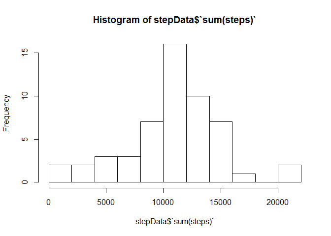
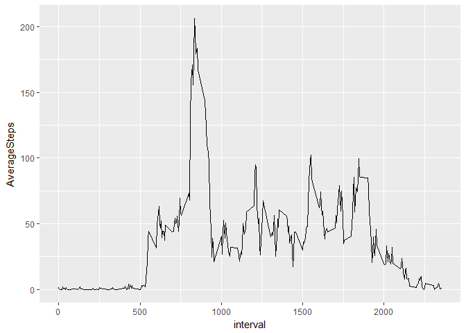
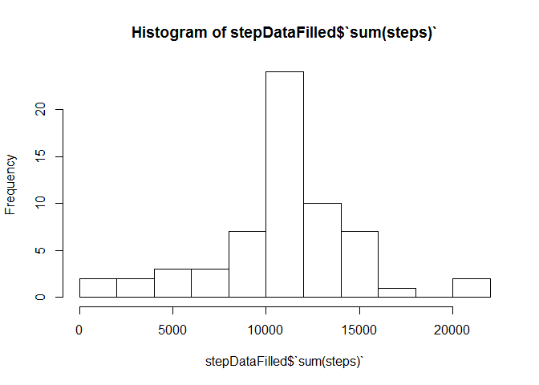
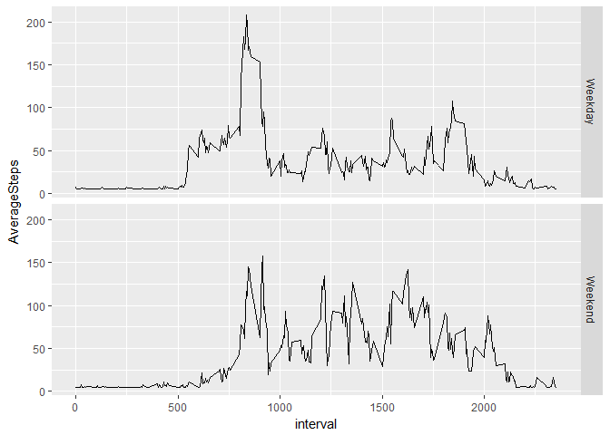

This goal of this docment is to demonstrate a simple analysis of human
activity data.

Processing the Data
===================

This analysis uses the Dplyr and the GGplot2 package that have to be
loaded first

    library(dplyr)
    library(ggplot2)

For reading the data it is assumed that the data is in the working
directory.

    activityData<-read.csv("activity.csv")

A quick look at the data ensures that all the variables are in an
approbriate form for analysis

    str(activityData)

    ## 'data.frame':    17568 obs. of  3 variables:
    ##  $ steps   : int  NA NA NA NA NA NA NA NA NA NA ...
    ##  $ date    : Factor w/ 61 levels "2012-10-01","2012-10-02",..: 1 1 1 1 1 1 1 1 1 1 ...
    ##  $ interval: int  0 5 10 15 20 25 30 35 40 45 ...

Exploratory analysis
====================

For each day the sum of steps is formed. The Histogram shows the
frequency of daily sums of steps

    stepData<- activityData  %>%group_by(date) %>% summarize(sum(steps))

    hist(stepData$`sum(steps)`, breaks = 10)

The mean and median sum of steps across all days:

    median(stepData$`sum(steps)`, na.rm=TRUE )

    ## [1] 10765

    mean(stepData$`sum(steps)`, na.rm=TRUE )

    ## [1] 10766.19

Mean and the median are very close together

Activity patterns
=================

Now we are examining the average number of steps in all intervals. A
plot shows the 5 minute intervals and the average number of steps taken
across days.

    stepDataInterval<- activityData  %>%group_by(interval) %>% summarize(AverageSteps=mean(steps, na.rm=TRUE))

    ggplot(stepDataInterval, aes(x=interval, y=AverageSteps)) + geom_line()

The interval with the maximum average number of steps across all days is
calculated by the following code:

    maxIntervall<-stepDataInterval %>% filter(AverageSteps==max(AverageSteps, na.rm = TRUE))
    maxIntervall[,1]

    ## # A tibble: 1 x 1
    ##   interval
    ##      <int>
    ## 1      835

The finding is that interval 835 is the interval with the highest
average number of steps.

Dealing with missing values
===========================

To get an idea how many values are missing the number of rows are
counted that contain a missing value

    nrow(activityData  %>% filter(is.na(steps)))

    ## [1] 2304

The missing data shall be replaced by an assumption. In this case the
average steps per interval across all days and intervals is taken for
filling the gaps. A new variable is assigned to create a new dataset
without NA values.

    activityDataFilled<- activityData 
    activityDataFilled<-replace(activityDataFilled,is.na(activityDataFilled), mean(activityData$steps, na.rm=TRUE))
    stepDataFilled<- activityDataFilled  %>%group_by(date) %>% summarize(sum(steps))

We make the same Histogram for the number of steps as above in order to
see what filling the missing data has changed

    hist(stepDataFilled$`sum(steps)`, breaks = 10)

    median(stepDataFilled$`sum(steps)`, na.rm=TRUE )

    ## [1] 10766.19

    mean(stepDataFilled$`sum(steps)`, na.rm=TRUE )

    ## [1] 10766.19

Finding different activity patterns
===================================

Finally we analyse whether there are differences in activity patterns
across weekends and week days? A new variable is introduced indicating
whether the day is weekend or not.

    activityDataFilled$WE<-weekdays(as.Date(activityDataFilled$date))

    activityDataFilled$WE<-ifelse(activityDataFilled$WE %in% c("Samstag","Sonntag"),"Weekend","Weekday")

    stepDataAvFilled<- activityDataFilled  %>% group_by(interval, WE) %>% summarize(AverageSteps=mean(steps))

    ggplot(stepDataAvFilled, aes(x=interval, y=AverageSteps)) + geom_line()+  
       facet_grid( WE ~.)

 I
can be seen from the Charts, that on weekends, the activity starts later
in the day. An explanation would be that you sleep longer if you dont
have to get up early for work.
